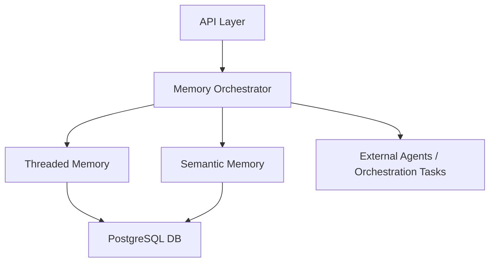

# 🏗 DESIGN — EchoCore

---

🇬🇧 **English Version**

---

## 📖 Overview

EchoCore is a modular GPT Memory Engine designed for developer tools, orchestration systems, and automation layers.  
It combines persistent threaded memory, semantic vector search, and orchestration control, all exposed via a clean API.

---

## 🏗 System Architecture

- API Layer → Provides RESTful endpoints, integrates with Swagger/OpenAPI

- Memory Orchestrator → Central coordinator between memory modules and tasks

- Threaded Memory → Stores conversational history with context and metadata

- Semantic Memory → Uses OpenAI embeddings for vector search and similarity

- Database Layer → PostgreSQL backend for structured and vector data

---

## ⚙️ Technologies

- .NET 8 / C#

- Entity Framework Core 9

- PostgreSQL 14+

- OpenAI GPT-4o + Embedding APIs

- Docker + Docker Compose

- Swagger (Swashbuckle) for API docs

---

## 🔌 Design Highlights

✅ Modular, plug-and-play components
✅ Clean separation of memory and orchestration logic
✅ Supports both synchronous API calls and queued tasks
✅ Designed for scalability (horizontal deployment)
✅ Ready for integration with external AI agents and tools

---

## 🔐 Security Considerations

- API key protection and configurable rate limits

- Sensitive data encryption at rest (DB) and in transit (HTTPS)

- Scoped access for future multi-tenant support

---

## 🚀 Future Expansion

- Plugin framework for custom agents

- Multi-agent orchestration with role assignment

- Integration with cloud storage or vector databases

- Dashboard UI for managing memory and orchestrations

---

Last updated: May 2025

---

🇹🇭 ภาษาไทย

---

## 📖 ภาพรวม

EchoCore เป็น Engine แบบโมดูลาร์ สำหรับจัดการหน่วยความจำ GPT ออกแบบมาเพื่อเครื่องมือนักพัฒนา, ระบบ orchestration, และ automation layer
ระบบรวมความสามารถของหน่วยความจำแบบ thread, การค้นหาแบบเวกเตอร์เชิงความหมาย, และการควบคุม orchestration ผ่าน API ที่ชัดเจน

---

## 🏗 สถาปัตยกรรมระบบ

- API Layer → ให้ RESTful endpoint พร้อม Swagger/OpenAPI

- Memory Orchestrator → ตัวประสานงานกลางระหว่างโมดูลหน่วยความจำและงาน

- Threaded Memory → เก็บประวัติการสนทนาพร้อม context และ metadata

- Semantic Memory → ใช้ OpenAI embeddings สำหรับค้นหาเวกเตอร์และความคล้ายคลึง

- Database Layer → ใช้ PostgreSQL สำหรับข้อมูลโครงสร้างและเวกเตอร์

---

## ⚙️ เทคโนโลยีที่ใช้

- .NET 8 / C#

- Entity Framework Core 9

- PostgreSQL 14+

- OpenAI GPT-4o + Embedding API

- Docker + Docker Compose

- Swagger (Swashbuckle) สำหรับเอกสาร API

---

## 🔌 จุดเด่นด้านการออกแบบ

✅ โมดูลาร์ แยกส่วน ต่อขยายได้
✅ แยก logic ระหว่าง memory และ orchestration อย่างชัดเจน
✅ รองรับทั้ง synchronous API และ queued tasks
✅ ออกแบบให้ขยายได้ (horizontal scaling)
✅ เตรียมพร้อมเชื่อมต่อกับ AI agents ภายนอก

---

## 🔐 การออกแบบด้านความปลอดภัย

- การป้องกัน API key และการจำกัดความถี่การเข้าถึง (rate limit)

- เข้ารหัสข้อมูลสำคัญทั้งขณะเก็บ (at rest) และส่งผ่าน (in transit)

- รองรับ multi-tenant ในอนาคต (scoped access)

---

## 🚀 การขยายในอนาคต

- ระบบ plugin สำหรับ custom agent

- Orchestration แบบ multi-agent พร้อมการกำหนดบทบาท

- การเชื่อมต่อ cloud storage หรือ vector database

- สร้าง Dashboard UI สำหรับจัดการ memory และ orchestration

---

อัพเดตล่าสุด: พฤษภาคม 2025