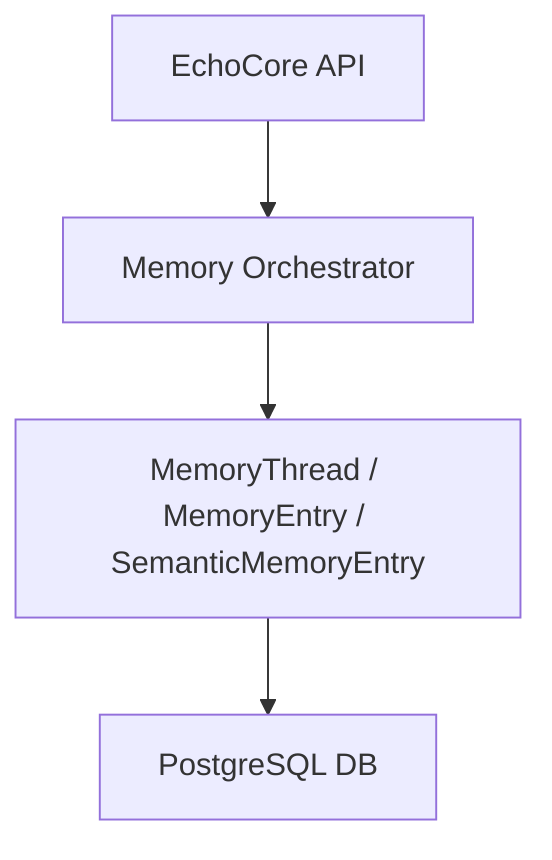

# 🧠 EchoCore — GPT Memory Core for Dev Tools & Helion Engine

[](https://dotnet.microsoft.com/)
[](https://www.postgresql.org/)
[](https://platform.openai.com/)
[](LICENSE)
[](https://www.docker.com/)

---

🇬🇧 English Version

---

## 📖 Overview

**EchoCore** is an extendable, modular GPT Memory Engine built for:

- 🛠 **Developer Tools** → AI agents, chatops, dev automation

It allows LLMs to **remember, reason, and recall** over long-term conversations, combining:

- Threaded memory (`MemoryThread` + `MemoryEntry`)
- Semantic vector search (`SemanticMemoryEntry`) with OpenAI embeddings

This project is designed for developers who want to **integrate memory + intelligence layers** into tools, games, or automation systems.

---

## 🌟 Features

✅ Threaded persistent memory  
✅ Semantic vector search with OpenAI embeddings  
✅ GPT-4o integration (including vision + image input support)  
✅ Modular + pluggable architecture  
✅ Dependency injection ready  
✅ Docker-ready deployment  
✅ Swagger/OpenAPI auto-generated docs  
✅ Configurable rate limiting + API safeguards

---

## 🏗 Architecture



---

## ⚙️ Technologies

- [.NET 8 / C#](https://dotnet.microsoft.com/)
- Entity Framework Core 9
- PostgreSQL 14+
- OpenAI GPT-4o + `text-embedding-3-small`
- Docker + Docker Compose
- Swagger / Swashbuckle

---

## 🚀 Quick Start

### Prerequisites

- Install [.NET 8 SDK](https://dotnet.microsoft.com/en-us/download/dotnet/8.0)
- Install [PostgreSQL 14+](https://www.postgresql.org/download/)
- Get an [OpenAI API Key](https://platform.openai.com/account/api-keys)
- Install [Docker](https://www.docker.com/) (optional but recommended)

---

### Clone the Repository

```bash
git clone https://github.com/Simulationable/MultiAgentOrchestration.git
cd echo-core
```

---

### Configure Settings

Edit appsettings.json:

```json
{
  "ConnectionStrings": {
    "DefaultConnection": "Host=localhost;Port=5432;Database=echo_core;Username=postgres;Password=YourPassword"
  },
  "OpenAI": {
    "ApiKey": "Your-OpenAI-API-Key",
    "ChatModel": "gpt-4o",
    "EmbeddingModel": "text-embedding-3-small"
  }
}
```

---

## Apply EF Core Migrations

### 🔄 Initial Setup

```bash
dotnet tool update --global dotnet-ef
```

### 🧱 Create Migration

```bash
dotnet ef migrations add AddSemanticMemoryEntry --project .\EchoCore
```

### 🧱 Remove Migration

```bash
dotnet ef migrations remove --project .\EchoCore
```

### 🛠 Apply to Database

```bash
dotnet ef database update --project .\EchoCore
```

---

## Run the App

```bash
dotnet run --project .\EchoCore
```

Access Swagger docs at http://localhost:8080/swagger

---

## 🐳 Docker (Recommended)

```bash
docker compose build
docker compose up -d
docker compose logs -f
docker ps
```

To stop:

```bash
docker compose down
```

---

## 🔌 API Endpoints

| Endpoint           | Description                    |
| ------------------ | ------------------------------ |
| `/api/agents`      | Run agent task                 |
| `/api/orchestrate` | Run orchestration tasks        |
| `/api/project`     | Manage Project                 |
| `/api/thread`      | Manage Thread                  |
| `/swagger`         | API documentation (Swagger UI) |

---

## 🛡 Security & Rate Limiting

- IP-based rate limiting (IpRateLimiting middleware)
- Configurable rules in appsettings.json

---

## 👥 Contributing

We welcome contributions!

- Fork this repository

- Create a feature branch (git checkout -b feature/my-feature)

- Commit your changes

- Open a pull request

---

## 📄 License

This project is licensed under the MIT License.
© 2025 Thanakan Klangkasame

---

## 📬 Contact

For questions, feature requests, or collaborations:
Email: thanakarn.klangkasame@gmail.com

---

🇹🇭 ภาษาไทย

---

## 📖 ภาพรวม

EchoCore คือ Engine สำหรับจัดการหน่วยความจำ GPT แบบโมดูลาร์ ใช้ได้กับ:

🛠 Dev Tools → ตัวช่วย AI, automation, chatops

ระบบนี้ช่วยให้ LLM จำ, วิเคราะห์, และเรียกคืนข้อมูลได้อย่างแม่นยำ ผ่านทั้ง:

Threaded memory (MemoryThread + MemoryEntry)

Semantic vector (SemanticMemoryEntry) ด้วย OpenAI embeddings

---

## 🌟 ฟีเจอร์เด่น

✅ หน่วยความจำแบบ thread เก็บข้อมูลระยะยาว
✅ Semantic search ด้วย embedding vectors
✅ การเชื่อมต่อ GPT-4o (รวม vision + รูปภาพ)
✅ โครงสร้าง modular ต่อขยายง่าย
✅ พร้อมใช้งานกับ Docker
✅ Swagger UI สำหรับเอกสาร API
✅ ระบบจำกัด rate เพื่อความปลอดภัย

---

## ⚙️ เทคโนโลยี

- .NET 8 / C#

- Entity Framework Core 9

- PostgreSQL 14+

- OpenAI GPT-4o + text-embedding-3-small

- Docker + Docker Compose

---

## 🚀 วิธีเริ่มต้น

- Install [.NET 8 SDK](https://dotnet.microsoft.com/en-us/download/dotnet/8.0)
- Install [PostgreSQL 14+](https://www.postgresql.org/download/)
- Get an [OpenAI API Key](https://platform.openai.com/account/api-keys)
- Install [Docker](https://www.docker.com/) (optional but recommended)

---

### โคลนโปรเจกต์

```bash
git clone https://github.com/Simulationable/MultiAgentOrchestration.git
cd echo-core
```

---

### ตั้งค่า

แก้ appsettings.json:

```json
{
  "ConnectionStrings": {
    "DefaultConnection": "Host=localhost;Port=5432;Database=echo_core;Username=postgres;Password=YourPassword"
  },
  "OpenAI": {
    "ApiKey": "Your-OpenAI-API-Key",
    "ChatModel": "gpt-4o",
    "EmbeddingModel": "text-embedding-3-small"
  }
}
```

---

## Apply EF Core Migrations

### 🔄 เริ่มระบบ

```bash
dotnet tool update --global dotnet-ef
```

### 🧱 สร้าง Migration

```bash
dotnet ef migrations add AddSemanticMemoryEntry --project .\EchoCore
```

### 🧱 ลบ Migration

```bash
dotnet ef migrations remove --project .\EchoCore
```

### 🛠 นำไปใช้กับ Database

```bash
dotnet ef database update --project .\EchoCore
```

---

## การรันระบบ

```bash
dotnet run --project .\EchoCore
```

เข้า Swagger ได้ที่ http://localhost:8080/swagger

---

## 🐳 Docker (Recommended)

```bash
docker compose build
docker compose up -d
docker compose logs -f
docker ps
```

หยุด Docker:

```bash
docker compose down
```

---

## 🔌 API Endpoints

| Endpoint           | Description                    |
| ------------------ | ------------------------------ |
| `/api/agents`      | รันงานแบบ Agent                |
| `/api/orchestrate` | รันงานแบบ Orchestra            |
| `/api/project`     | จัดการโครงการ                  |
| `/api/thread`      | จัดการ Thread                  |
| `/swagger`         | API documentation (Swagger UI) |

---

## 🛡 ความปลอดภัย และจำกัดความถี่ของการเข้าถึง

- การจำกัดความถี่ของการเข้าถึงตาม IP (โดยใช้ middleware ชื่อ IpRateLimiting)
- ตั้งค่ากฎการจำกัดเหล่านี้ได้ในไฟล์ appsettings.json

---

## 👥 การร่วมพัฒนา (Contributing)

เรายินดีต้อนรับทุกการมีส่วนร่วม!

- ทำการ **fork** repository นี้ไปที่บัญชีของคุณ
- สร้าง **feature branch**

  ```bash
  git checkout -b feature/my-feature

  ```

- ทำการ commit การแก้ไขของคุณ

- เปิด pull request กลับเข้ามาที่ repository หลัก

---

## 📄 ลิขสิทธิ์ (License)

โปรเจกต์นี้เผยแพร่ภายใต้สัญญาอนุญาต MIT License
© 2025 ธนาคาร คลังเกษม

---

## 📬 ติดต่อ (Contact)

หากมีคำถาม, ข้อเสนอแนะ, หรืออยากร่วมงาน:
อีเมล: thanakarn.klangkasame@gmail.com
